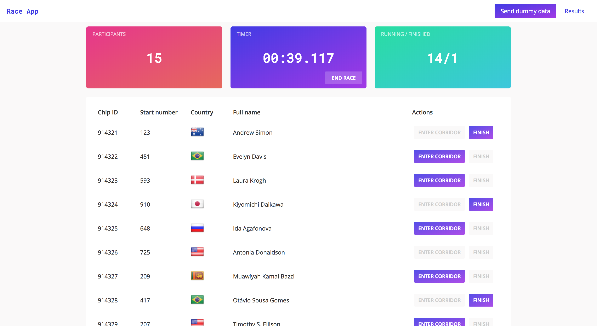
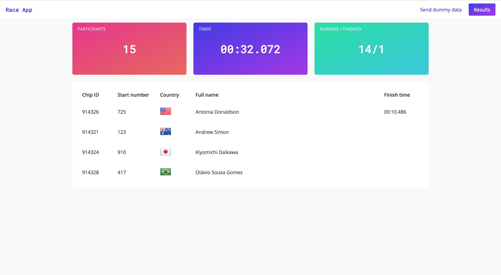

# Sports event timing

Web app for keeping track of sports event timings. 

## Used technologies

* React + Redux
* Node.js
* Websockets (socket.io)
* SQLite

## Getting Started

These instructions will get you a copy of the project up and running on your local machine for development and testing purposes.

### Server

* Download [SQLite](https://www.sqlite.org/download.html)
* Navigate to server folder, install dependencies and start server

```
cd server
npm install
npm run start
```

### UI

* Navigate to client folder, install dependencies and start project

```
cd client
npm install
npm start
```

## How to use?

Once you have the server and client running, open `http://localhost:3000/` on your browser.

### Send dummy data

Here you can start the race and then make athletes enter finish corridor and cross the finish line.
You also get an overview of the race:
* number of athletes
* wall clock time
* number of athletes running and finished

Once all the athletes have finished, the race ends. If you don't want to wait that long, you can end it also manually.



### Results

This page displays all the athletes who have entered the finish corridor. When an athlete enters the finish corridor,
a new row is added at the bottom of the table. Once athlete crosses finish line, the finish time is also added to the row.
All athletes are displayed in the correct order.

This page also includes the race overview but without the possibilities to start and end the race.

